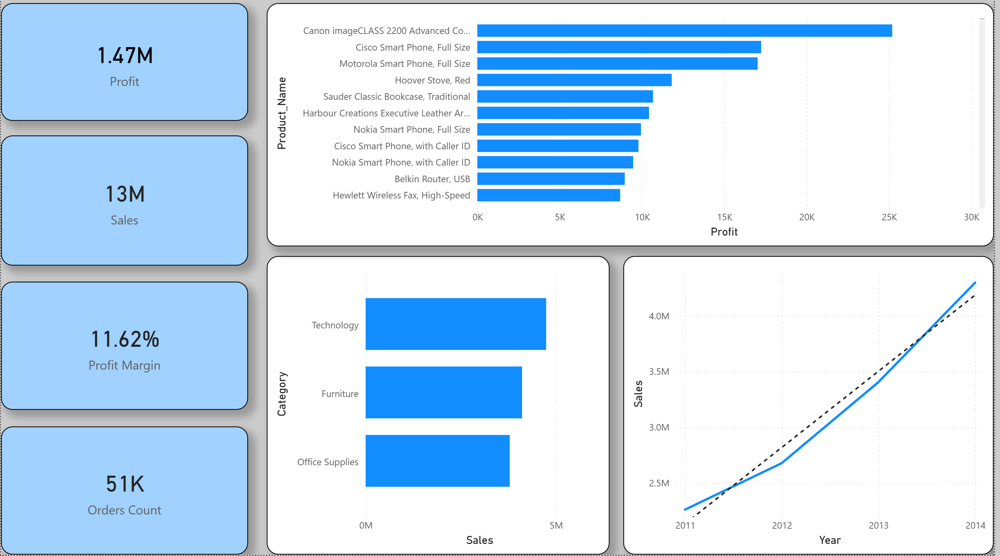

# Superstore-SQL-Project
# 🛒 Superstore Sales Analysis | SQL + Power BI Project

## 📌 Project Overview

This project analyzes a retail dataset (Superstore) to uncover key business insights related to **sales performance, profitability, customer behavior, and product efficiency**.

The goal is to simulate a real-world business scenario and provide **data-driven recommendations** using SQL and Power BI.

---

## 🎯 Business Objectives

* Identify top-performing products and categories
* Analyze profit vs sales performance
* Segment customers based on spending behavior
* Evaluate the impact of discounts on profitability
* Track sales trends over time

---

## 🛠 Tools & Technologies

* **MySQL** → Data querying & analysis
* **SQL** → JOIN, GROUP BY, WINDOW FUNCTIONS, SUBQUERIES
* **Power BI** → Data visualization & dashboard
* **Excel/CSV** → Dataset

---

## 🧱 Data Model

The dataset consists of 3 main tables:

* **Customers** → customer_name, country, region
* **Orders** → order_id, order_date, quantity, discount
* **Products** → product_name, category, sales, profit

Relationships:

* Orders ↔ Customers
* Orders ↔ Products

---

## 📊 Key Analysis Performed

### 🔹 Sales & Profit Analysis

* Total Revenue & Total Profit
* Profit Margin calculation
* Sales by Category

### 🔹 Product Performance

* Top 10 Products by Profit
* Bottom 10 Products (Loss-making)
* Profit vs Sales relationship

### 🔹 Customer Analysis

* Top Customers by Revenue
* Customer Segmentation (VIP, Regular, Low)

### 🔹 Time Analysis

* Monthly & Yearly Sales Trends

### 🔹 Advanced SQL

* Window Functions (RANK, LAG)
* Subqueries
* Aggregations

---

## 📈 Dashboard Highlights

The Power BI dashboard includes:

* 📌 KPI Cards:

  * Total Sales
  * Total Profit
  * Profit Margin
  * Orders Count

* 📊 Visualizations:

  * Sales Trend Over Time
  * Top & Worst Products
  * Sales by Category
  * Customer Segmentation
  * Sales vs Profit Scatter Plot
  * Geographic Sales Distribution

---

## 🔍 Key Insights

* High discounts negatively impact profitability
* A small percentage of customers (VIPs) generate a large portion of revenue
* Some products achieve high sales but low profit margins
* Technology category is the most profitable
* Sales show consistent growth over time

---

## 📂 Project Structure

```
Superstore-SQL-Project/
│
├── dataset/
├── sql/
│   ├── 01_basic_analysis.sql
│   ├── 02_advanced_analysis.sql
│   ├── 03_case_study.sql
│
├── powerbi/
│   └── dashboard.pbix
│
├── images/
│   └── dashboard.png
│
└── README.md
```

---

## 📸 Dashboard Preview

## 📸 Dashboard Preview

### 1. Overview Dashboard


### 2. Customer Analysis


### 3. Product Analysis


### 4. Time Analysis

---

## 💡 Business Recommendations

* Reduce discounts on low-margin products
* Focus marketing efforts on high-value customers
* Optimize or remove loss-making products
* Invest more in high-performing categories
